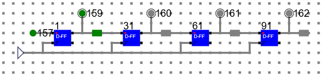
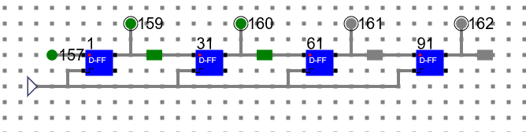
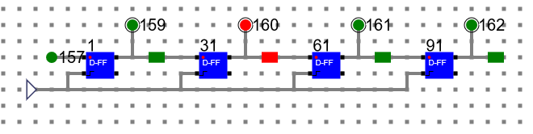

# Theory:

Shift Register is a group of flip flops used to store multiple bits of data. The bits stored in such registers can be made to move within the registers and in/out of the registers by applying clock pulses. An n-bit shift register can be formed by connecting n flip-flops where each flip-flop stores a single bit of data. The registers which will shift the bits to the left are called “Shift left registers”. The registers which will shift the bits to the right are called “Shift right registers”. Shift registers are basically of following types.

## Types of Shift Registers
- Serial In Serial Out shift register
- Serial In parallel Out shift register
- Parallel In Serial Out shift register
- Parallel In parallel Out shift register
- Bidirectional Shift Register
- Universal Shift Register
- Shift Register Counter

Here our experiment is with serial in serial out shift register only.

## Circuit Diagram of a SISO (Serial In/Serial Out) Shift Register

We have designed D-FF as shown in earlier experiment and used the same here to design a shift register. We have used 1 bit memory element to store the output bit from each D-FF in the circuit.

### Step 1: (Initial State) 

The input bit is 157. 

The output bits are 159, 160, 161, 162. 

Initially register contains no data.

### Step 2: 

Input Bit: 157:1 and clock.

Output Bit: 159: 1

### Step 3:

Input Bit: 157:1 and clock.

Output Bit: 159: 1, 160:1

### Step 4:

Input Bit: 157:0 and clock.

Output Bit: 159: 0, 160:1, 161:1

### Step 5:

Input Bit: 157:1 and clock.

Output Bit: 159: 1, 160:0, 161:1, 162:1

### Step 6:

Input Bit: 157:0 and clock.

Output Bit: 159: 0, 160:1, 161:0, 162:1

At each clock, all the bits are shifted 1 step to the right side and stored in the register.

