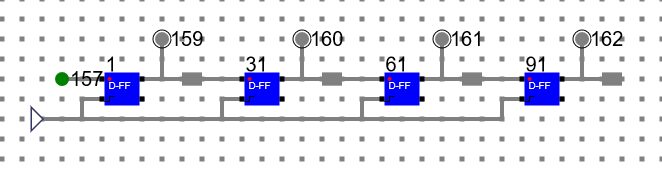
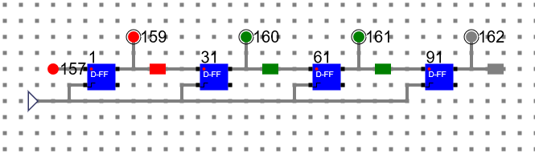
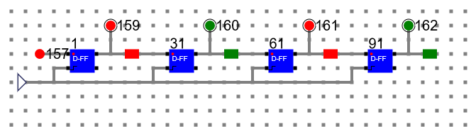

# Procedure

- Design Latch circuit and make a component say ‘Latch’.
 

 

- Using the latch, design a D-FF and make a component as shown below.
 

## Circuit Diagram of a SISO (Serial In/Serial Out) Shift Register

We have designed D-FF as shown in earlier experiment and used the same here to design a shift register. We have used 1 bit memory element to store the output bit from each D-FF in the circuit.

### Step 1: (Initial State) 

The input bit is 157. 

The output bits are 159, 160, 161, 162. 

Initially register contains no data.

### Step 2: 

Input Bit: 157:1 and clock.

Output Bit: 159: 1

### Step 3:

Input Bit: 157:1 and clock.

Output Bit: 159: 1, 160:1

### Step 4:

Input Bit: 157:0 and clock.

Output Bit: 159: 0, 160:1, 161:1

### Step 5:

Input Bit: 157:1 and clock.

Output Bit: 159: 1, 160:0, 161:1, 162:1

### Step 6:

Input Bit: 157:0 and clock.

Output Bit: 159: 0, 160:1, 161:0, 162:1

At each clock, all the bits are shifted 1 step to the right side and stored in the register.

# Manual
## Follow the below manual and perform the experiment

- Manual --> [Click Here](./simulation/coavlNew.pdf)

<embed src="./simulation/coavlNew.pdf" type="application/pdf">

